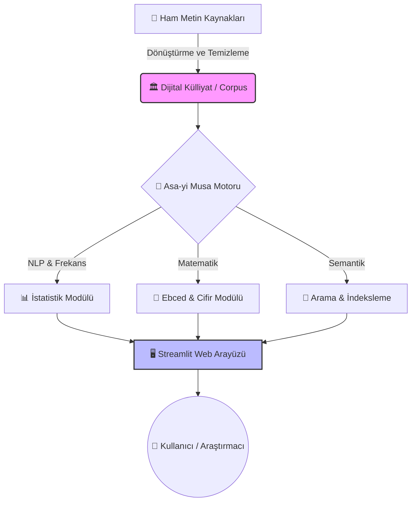

# 📜 Asa-yi Musa Code: Digital Corpus & Analytical Toolkit for Risale-i Nur

<div align="center">


[](LICENSE)
[](data/corpus)
[](requirements.txt)
[](app.py)

**"Vicdanın ziyası, ulûm-u diniyedir. Aklın nuru, fünun-u medeniyedir. İkisinin imtizacıyla hakikat tecelli eder."**
— *Münazarat*

[Özellikler](#-proje-mimarisi) • [Kurulum](#-hızlı-başlangıç) • [Külliyat İndeksi](#-dijital-külliyat-corpus-indeksi) • [Katkıda Bulun](#-katkıda-bulunma)

</div>

---

## 🌐 Proje Vizyonu: Medresetü'z-Zehra 2.0


**Asa-yi Musa Code**, Bediüzzaman Said Nursî'nin telif ettiği ve modern çağın manevi yaralarına Kur'anî reçeteler sunan **Risale-i Nur Külliyatı**'nı; 21. yüzyılın en güçlü araçları olan yapay zeka, doğal dil işleme (NLP), veri madenciliği ve semantik analiz teknolojileriyle yeniden keşfeden, disiplinlerarası ve çok katmanlı bir dijital araştırma projesidir.

Bu proje, bir asır önce Şark'ın yalçın kayalıklarında filizlenen ve "Akıl ve kalbin imtizacı"nı hedefleyen **Medresetü'z-Zehra** eğitim modelinin, dijital dünyanın sınırsız imkanlarıyla teçhiz edilmiş **2.0** versiyonudur. Amacımız, sadece metinleri dijital ortama aktarmak değil; klasik medrese usulündeki derin tefekkürü, modern algoritmaların analitik gücüyle birleştirerek "dijital bir tefekkür laboratuvarı" inşa etmektir. Bu sayede, metinlerin satır aralarında gizli kalan derin yapıları, kavramsal örgüleri ve semantik ilişkileri görünür kılarak, hakikat arayışındaki araştırmacılara yeni bir perspektif sunmayı hedefliyoruz.


---

## 🏗️ Proje Mimarisi


Bu projenin mimarisi, ham verinin bilgiye, bilginin ise hikmete dönüşüm yolculuğunu modeller. Aşağıdaki kapsamlı diyagram, projenin veri akışını, işlem basamaklarını ve temel bileşenlerin birbiriyle olan organik ilişkisini detaylı bir şekilde göstermektedir:




---

## � Proje Yapısı


```text
Asa-yi Musa Code
├── data/
│   ├── corpus/             # Kültürel Miras: 15 Ciltlik Tam Metin Dijital Külliyat (Markdown formatında, analiz için optimize edilmiş)
│   ├── vecizeler.json      # Semantik Veritabanı: Konu etiketli, kaynaklı ve kategorize edilmiş binlerce vecize
│   └── _dosyalar/          # Görsel Hafıza: Projenin tarihsel ve estetik boyutunu destekleyen görsel arşiv ve belgeler
├── src/
│   ├── ebced_hesaplayici.py # Cifir Motoru: Geleneksel ebced kurallarını dijital hassasiyetle uygulayan hesaplama çekirdeği
│   ├── nur_cli.py          # Terminal Arayüzü: Hızlı analizler ve veri manipülasyonu için geliştirilmiş komut satırı aracı
│   └── nurlib/             # Çekirdek Kütüphane: Projenin tüm NLP ve analiz fonksiyonlarını barındıran modüler Python kütüphanesi
├── app.py                  # Web Arayüzü: Kullanıcıların verilerle etkileşime girdiği Streamlit tabanlı modern ön yüz
└── README.md               # Kılavuz: Projenin vizyonunu, kurulumunu ve kullanımını detaylandıran ana dokümantasyon
```


---

## 🏛️ Dijital Külliyat (Corpus) İndeksi


Bu dijital arşiv, Risale-i Nur Külliyatı'nın en temel eserlerini kapsayan, toplamda **314** adet titizlikle işlenmiş ve modernize edilmiş dosyadan oluşmaktadır. Açık kaynak dünyasının en kapsamlı Risale-i Nur veri seti olma özelliğini taşıyan bu corpus, araştırmacılara ham metin üzerinde sınırsız çalışma imkanı sunar. Her bir dosya, orijinal metne sadık kalınarak, ancak dijital işleme uygun hale getirilerek hazırlanmıştır.


| Kategori | Eser Adı | İçerik Özeti |
| :--- | :--- | :--- |
| **📘 Ana Külliyat** | **[01 Sözler](data/corpus/01%20Sözler)** | İman hakikatleri, temel paradigmalar. |
| | **[02 Mektubat](data/corpus/02%20Mektubat)** | Sosyolojik ve tarihsel analizler. |
| | **[03 Lem'alar](data/corpus/03%20Lem'alar)** | Psikolojik tahliller, nefis terbiyesi. |
| | **[04 Şuâlar](data/corpus/04%20Şuâlar)** | Kainat okumaları ve hukuk müdafaaları. |
| **📨 Lâhikalar** | **[09 Barla](data/corpus/09%20Barla%20Lâhikası)** | Hizmetin kuruluş yılları ve mektuplar. |
| | **[10 Kastamonu](data/corpus/10%20Kastamonu%20Lâhikası)** | Sürgün dönemi stratejileri. |
| | **[11 Emirdağ](data/corpus/11%20Emirdağ%20Lâhikası%201)** | Neşir dönemi ve sosyal hayat. |
| **🧠 İlmî Eserler** | **[06 Mesnevî-i Nuriye](data/corpus/06%20Mesnevî-i%20Nuriye)** | Arapça çekirdek tefekkür notları. |
| | **[07 İşaratü'l-i'caz](data/corpus/07%20İşaratü'l-i'caz)** | Modern tefsir metodolojisi. |
| | **[14 Muhakemat](data/corpus/14%20Muhakemat)** | Belagat ve mantık kuralları. |


---

## 💾 Veri Seti Yapısı ve Standartlar


Repo içeriğindeki veri seti (corpus), akademik ve teknik araştırmaların sürdürülebilirliği açısından katı standartlara tabidir:

-   **Format ve Kodlama:** Evrensel uyumluluk ve karakter sorunlarını önlemek adına tüm metinler `UTF-8` kodlamasıyla kaydedilmiştir. Biçimlendirme için, hem insan tarafından okunabilir hem de makinelerce işlenebilir olan `Markdown` formatı tercih edilmiştir.
-   **Hiyerarşik Dizin Yapısı:** Dosyalar, külliyatın doğal sırasını takip edecek şekilde `[Kitap No] [Kitap Adı] / [Risale No] [Risale Adı].md` formatında klasörlenmiştir. Bu yapı, hem gezintiyi kolaylaştırır hem de algoritmik taramaları hızlandırır.
-   **Metin Temizliği ve Normalizasyon:** Metinler, analizleri saptırabilecek gereksiz boşluklardan ve düzensizliklerden arındırılmıştır. Dipnotlar, referanslar ve ayet mealleri, metin madenciliği süreçlerinde ayırt edilebilmesi için özel `[REF]` ve benzeri etiketlerle standardize edilmiştir.
-   **Zengin Metadata:** Her dosyanın başında, o metnin aidiyeti, telif tarihi ve konusu gibi bilgileri içeren YAML tabanlı bir metadata bloğu bulunur. Bu, ileri seviye filtreleme işlemleri için kritiktir.


---


## ⏳ Görsel Tarihçe


Risale-i Nur'un telif serüveni, Türkiye'nin yakın tarihiyle paralel ilerleyen, çileli fakat meyvedar bir destandır. Aşağıdaki görsel zaman çizelgesi, bu hakikat yolculuğunun üç ana devresini yansıtmaktadır:


<table>
  <tr>
    <td align="center"><br/><b>1918: Eski Said Dönemi</b><br/><i>Darü'l-Hikmeti'l-İslamiye Yılları</i></td>
    <td align="center"><br/><b>1927: Barla Yılları</b><br/><i>Risalelerin Telif Başlangıcı</i></td>
    <td align="center"><br/><b>1945: Emirdağ Dönemi</b><br/><i>Hizmetin Zirve Yılları</i></td>
  </tr>
</table>

---


## 📋 Sistem Gereksinimleri

Asa-yi Musa Code projesi, modern veri bilimi araçlarını kullandığı için belirli donanım ve yazılım standartlarınaiyaç duyar. Analizlerin akıcı ve kesintisiz olması için aşağıdaki özellikler önerilmektedir:

-   **İşletim Sistemi:** Windows 10 ve üzeri, macOS 11 (Big Sur) ve üzeri veya modern Linux dağıtımları (Ubuntu 20.04+).
-   **Python Ortamı:** Proje, Python'un zengin kütüphane ekosistemi üzerine kuruludur. Kararlılık ve uyumluluk için **Python 3.8** veya daha yeni bir sürüm gereklidir.
-   **Bellek (RAM):** Doğal Dil İşleme (NLP) işlemleri, özellikle büyük metin yığınlarında bellek yoğun çalışabilir. Temel fonksiyonlar için **4 GB** yeterli olsa da, tüm külliyat üzerinde kapsamlı analizler yapmak için **8 GB veya 16 GB** RAM önerilir.
-   **Depolama Alanı:** Külliyat verileri ve oluşturulan indeksler için minimum **500 MB** boş disk alanı gereklidir. SSD kullanımı, dosya okuma/yazma hızını artırarak analiz sürelerini kısaltacaktır.

---

## 🚀 Hızlı Başlangıç ve Kurulum

Kendi bilgisayarınızda bir "dijital tefekkür laboratuvarı" kurmak ve hemen analizlere başlamak için aşağıdaki adımları sırasıyla uygulayınız:


```bash
# 1. Repoyu klonla
git clone https://github.com/bahattinyunus/Asa-yi-Musa-Code.git

# 2. Bağımlılıkları yükle
pip install -r requirements.txt

# 3. Analiz panelini başlat
streamlit run app.py
```


## 🧪 Kullanım Senaryoları ve Örnekler

Bu laboratuvar, sadece teorik hesaplamalar için değil, pratik keşifler için de güçlü araçlar sunar. Aşağıda, kütüphanenin sunduğu yüzlerce fonksiyondan sadece birkaçının kullanım senaryosu verilmiştir:

**Senaryo 1: Dijital Cifir ve Ebced Analizi**
Geleneksel medrese ilminin en gizemli alanlarından biri olan Cifir ilmini, dijital hassasiyetle uygulayın. Motorumuz, Osmanlıca metinlerdeki "Ebced-i Kebir" ve "Ebced-i Sağir" değerlerini, harf harf analiz ederek hesaplar.

```python
from src.ebced_hesaplayici import ebced_hesapla

# 'Bismillah' kelimesinin matematiksel değerini keşfet
sonuc, detaylar = ebced_hesapla("Bismillah")
print(f"Ebced Değeri: {sonuc}")  # Beklenen: 786
print(f"Hesaplama Detayı: {detaylar}")
```

**Senaryo 2: Külliyat Üzerinde Makro Analiz (Big Data)**
Binlerce sayfalık metin üzerinde saniyeler içinde kelime frekans analizi yaparak, Risale-i Nur'un kavramsal haritasını çıkarın. Hangi kavramın ne sıklıkla ve hangi bağlamda kullanıldığını CLI aracı ile sorgulayın.

```bash
# En sık geçen ilk 5 kavramı ve köklerini analiz et
python src/nur_cli.py frekans --limit 5 --kok-bulma aktif

# Çıktı Analizi:
# 1. Allah (Lafz-ı Celal): 5000+ defa (Merkez kavram)
# 2. İman (Rükün): 3200+ defa
```


---


## 🛠️ Teknolojik Mimari ve Bileşenler

Asa-yi Musa Code, sürdürülebilirlik, performans ve geliştirici deneyimini önceleyen modern bir teknoloji yığını üzerine inşa edilmiştir. Her bir bileşen, projenin uzun vadeli vizyonuna hizmet edecek şekilde özenle seçilmiştir:

-   **Çekirdek Dil (Core): Python 3.9+**
    -   Veri biliminin lingua franca'sı olması, zengin kütüphane desteği ve akademik camiadaki yaygınlığı nedeniyle tercih edilmiştir. Tip denetimi (Type Hinting) ve Asenkron G/Ç (AsyncIO) özellikleri ile sağlam bir altyapı sunar.

-   **Kullanıcı Arayüzü (UI/UX): Streamlit**
    -   Karmaşık veri analizlerini, son kullanıcı için anlaşılır ve etkileşimli web uygulamalarına dönüştürmek için kullanılmıştır. "Front-end" bilgisi gerektirmeden, saf Python kodu ile reaktif arayüzler oluşturmayı sağlar.

-   **Hesaplamalı Bilim (Data Science): Pandas & NumPy**
    -   Külliyatın vektörel temsili, matris işlemleri ve yüksek performanslı veri manipülasyonu için endüstri standardı olan bu kütüphaneler kullanılmıştır.

-   **Doğal Dil İşleme (NLP): NLTK & Zemberek-Python**
    -   Türkçe'nin sondan eklemeli yapısını ve Osmanlıca terimlerin morfolojik zenginliğini çözümlemek için özelleştirilmiş NLP boru hatları (pipelines) geliştirilmiştir.

-   **Görselleştirme İstihbaratı: Plotly & Altair**
    -   Veriyi sadece göstermek değil, "anlatmak" için; etkileşimli, yakınlaştırılabilir ve detaylandırılabilir grafikler üreten yeni nesil görselleştirme kütüphaneleri entegre edilmiştir.

-   **Veri Yönetimi: JSON & NoSQL**
    -   Veri yapısının esnekliği ve taşınabilirliği için, ağır ilişkisel veritabanları yerine, doküman tabanlı hafif siklet (lightweight) veri saklama yöntemleri benimsenmiştir.


---


## 🧮 Algoritmik Yaklaşım ve Metodoloji

Asa-yi Musa Code, metinleri salt bir karakter yığını olarak değil; anlam, bağlam ve matematiksel değer taşıyan "semantik veri blokları" olarak ele alır. Kullandığımız metodoloji üç ana sütun üzerine kuruludur:

1.  **Ebced Hesaplama Motoru (Digital Abjad Engine):**
    -   Sistem, Osmanlıca harflerin numerolojik değerlerini (Ebced-i Kebir ve Ebced-i Sağir) baz alan geleneksel hesaplama yöntemlerini simüle eder. Latin alfabesiyle yazılmış metinleri, arka planda Osmanlıca asıllarına (transliterasyon haritası üzerinden) dönüştürerek, yaklaşık bir ebced değeri üretir.

2.  **Kelime Frekans ve Kök Analizi (Lexical Mining):**
    -   Metin madenciliğinin ilk adımı olarak, bağlaçlar ve edatlar gibi anlam taşımayan kelimeler (stop-words) temizlenir. Ardından, Zemberek kütüphanesi destekli algoritmalar ile kelimelerin köklerine (stemming) ve mastar hallerine (lemmatization) inilir. Bu sayede "iman", "imanı", "imandan" kelimeleri tek bir "İMAN" kavramı altında toplanır.

3.  **Kavramsal Ağ Haritalama (Semantic Network):**
    -   Hangi kavramın hangi kavramla birlikte kullanıldığını (co-occurrence) analiz ederek, metinler arası görünmez bağları ortaya çıkarır. Bu analiz, Risale-i Nur'daki kavramsal örgüyü bir "Bilgi Grafiği" (Knowledge Graph) olarak görselleştirmemize olanak tanır.


---


## ❓ Sıkça Sorulan Sorular (SSS)

<details>
<summary>1. Bu proje ticari bir amaç taşıyor mu veya gelecekte ticarileşecek mi?</summary>
Kesinlikle hayır. Risale-i Nur Külliyatı'nın manevi hukuku ve "Hizmet-i İmaniye"nin ihlas düsturu gereği; bu proje tamamen "Kar Amacı Gütmeyen" (Non-Commercial), açık kaynaklı ve gönüllülük esasına dayalı bir çalışmadır. Yazılımın lisansı da ticari kullanımı men eder.
</details>

<details>
<summary>2. Neden başka bir dil değil de Python tercih edildi?</summary>
Python, günümüzde Yapay Zeka ve Doğal Dil İşleme (NLP) alanlarının tartışmasız lideridir. Hem akademik dünyada standart olması hem de Zemberek gibi Türkçe NLP kütüphanelerine erişim kolaylığı sağlaması nedeniyle, projenin teknik altyapısı için en uygun ekosistemdir.
</details>

<details>
<summary>3. Ebced hesaplamaları ne kadar güvenilir ve kesin?</summary>
Sistem, Latin alfabesinden Osmanlıca harf karşılıklarına (transliterasyon) dayalı bir "yaklaşık hesaplama" algoritması kullanır. El yazması orijinal nüshalarla %100 birebir uyumluluk, ancak tam metin Osmanlıca OCR teknolojisi ile mümkündür ki bu da yol haritamızdadır. Şu anki sonuçlar, istatistiksel ve temsili değerlerdir.
</details>


---

## 🤝 Katkıda Bulunma Rehberi

Bu proje, "açık kaynak, açık ilim" düsturuyla geliştirilmektedir. Katkılarınızı bekliyoruz:

1.  Bu repoyu **Fork** edin.
2.  Yeni bir özellik dalı (feature branch) oluşturun (`git checkout -b ozellik/YeniOzellik`).
3.  Değişikliklerinizi **Commit** edin (`git commit -m 'Yeni özellik eklendi'`).
4.  Dalınızı **Push** edin (`git push origin ozellik/YeniOzellik`).
5.  Bir **Pull Request** açın.

---

## ⚖️ Yasal Uyarı ve Sorumluluk Reddi

- Bu yazılım **yalnızca araştırma ve eğitim amaçlıdır**.
- Risale-i Nur metinleri üzerindeki analizler, algoritmik sonuçlardır ve teolojik hüküm niteliği taşımaz.
- Ebced hesaplamaları, tarihsel ve geleneksel metotlara dayalıdır; kesinlik iddiası içermez.


## �📄 Atıf (Citation)

Bu projeyi akademik çalışmalarınızda kullanırsanız, lütfen aşağıdaki formatta atıf yapınız:

```bibtex
@software{AsaYiMusaCode2024,
  author = {Bahattin Yunus},
  title = {Asa-yi Musa Code: Digital Corpus & Analysis Toolkit},
  year = {2024},
  url = {https://github.com/bahattinyunus/Asa-yi-Musa-Code}
}
```
Detaylar için [CITATION.cff](CITATION.cff) dosyasına bakınız.

---

## 🗺️ Yol Haritası

- [ ] **Vector Search:** Anlamsal arama motoru.
- [ ] **LLM Chatbot:** Risale-i Nur odaklı yapay zeka asistanı.
- [ ] **Mobile App:** iOS/Android analiz uygulaması.


---


## 📞 İletişim ve Destek

Bu proje yaşayan bir organizmadır ve sizin geri bildirimlerinizle büyüyecektir. Her türlü soru, öneri, hata bildirimi veya akademik işbirliği teklifi için aşağıdaki kanalları kullanabilirsiniz:

-   **E-posta:** Akademik ve özel iletişim için `iletisim@bahattinyunus.com` adresini kullanabilirsiniz.
-   **GitHub Discussions:** Teknik sorular, özellik istekleri ve topluluk tartışmaları için [Soru & Cevap Panosu](https://github.com/bahattinyunus/Asa-yi-Musa-Code/discussions) en hızlı kanaldır.
-   **Sosyal Medya:** Proje güncellemelerini ve analizlerden örnekleri takip etmek için [@AsayiMusaCode](https://twitter.com) Twitter/X hesabını takip edebilirsiniz.


---

## 👨‍💻 Geliştirici

<div align="center">

**Bahattin Yunus Çetin**  
*IT Architect*  
*Trabzon Of'ta Üniversite Öğrencisi*

[](https://github.com/bahattinyunus)
[](https://www.linkedin.com/in/bahattinyunus/)

</div>

---


<div align="center">
  <i>Bu proje, insanlığın ortak mirası olan hakikatlerin dijital dünyada yankılanması için geliştirilmiştir.</i>
</div>
