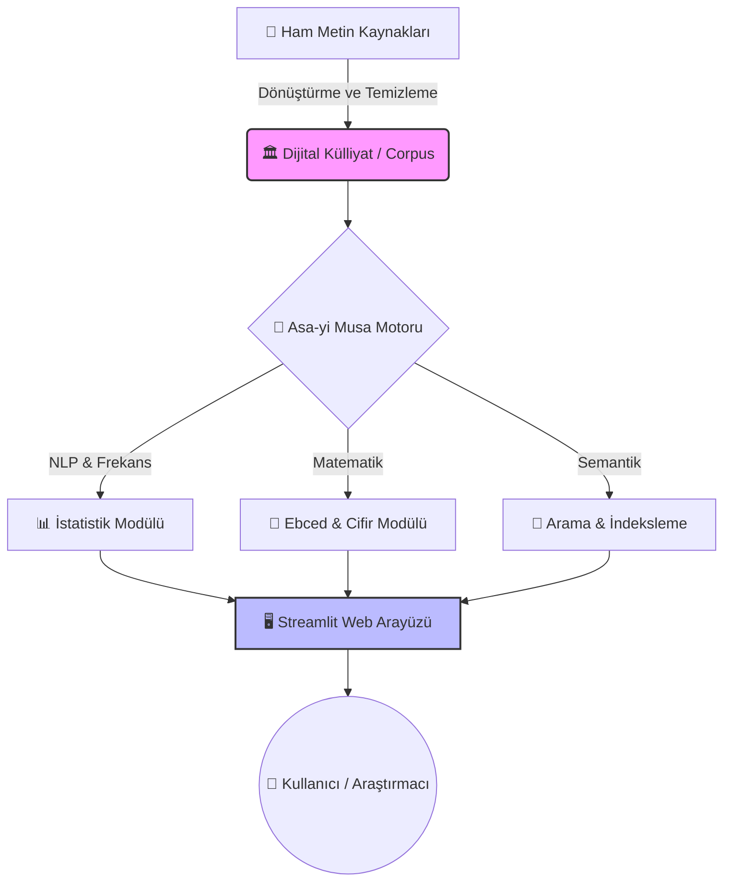

# 📜 Asa-yi Musa Code: Digital Corpus & Analytical Toolkit for Risale-i Nur

<div align="center">


[](LICENSE)
[](data/corpus)
[](requirements.txt)
[](app.py)

**"Vicdanın ziyası, ulûm-u diniyedir. Aklın nuru, fünun-u medeniyedir. İkisinin imtizacıyla hakikat tecelli eder."**
— *Münazarat*

[Özellikler](#-proje-mimarisi) • [Kurulum](#-hızlı-başlangıç) • [Külliyat İndeksi](#-dijital-külliyat-corpus-indeksi) • [Katkıda Bulun](#-katkıda-bulunma)

</div>

---

## 🌐 Proje Vizyonu: Medresetü'z-Zehra 2.0

**Asa-yi Musa Code**, Bediüzzaman Said Nursî'nin **Risale-i Nur Külliyatı**'nı; yapay zeka, doğal dil işleme (NLP) ve veri madenciliği araçlarıyla yeniden keşfeden disiplinlerarası bir araştırma projesidir.

Amacımız, klasik medrese usulünü "dijital tefekkür laboratuvarı" yaklaşımıyla modernize ederek, metinlerin derin yapısını ve kavramsal örgüsünü görünür kılmaktır.

---

## 🏗️ Proje Mimarisi

Aşağıdaki diyagram, projenin veri akışını ve bileşenlerini göstermektedir:



---

## � Proje Yapısı

```text
Asa-yi Musa Code
├── data/
│   ├── corpus/             # 15 Ciltlik Tam Metin Külliyat (Markdown)
│   ├── vecizeler.json      # Semantik Vecize Veritabanı
│   └── _dosyalar/          # Görsel Arşiv ve Belgeler
├── src/
│   ├── ebced_hesaplayici.py # Cifir Hesaplama Motoru
│   ├── nur_cli.py          # Komut Satırı Aracı
│   └── nurlib/             # Çekirdek Python Kütüphanesi
├── app.py                  # Streamlit Web Uygulaması
└── README.md               # Proje Dokümantasyonu
```

---

## 🏛️ Dijital Külliyat (Corpus) İndeksi

Toplam **314** adet işlenmiş dosya ile Risale-i Nur'un en kapsamlı açık kaynaklı dijital arşivlerinden biridir.

| Kategori | Eser Adı | İçerik Özeti |
| :--- | :--- | :--- |
| **📘 Ana Külliyat** | **[01 Sözler](data/corpus/01%20Sözler)** | İman hakikatleri, temel paradigmalar. |
| | **[02 Mektubat](data/corpus/02%20Mektubat)** | Sosyolojik ve tarihsel analizler. |
| | **[03 Lem'alar](data/corpus/03%20Lem'alar)** | Psikolojik tahliller, nefis terbiyesi. |
| | **[04 Şuâlar](data/corpus/04%20Şuâlar)** | Kainat okumaları ve hukuk müdafaaları. |
| **📨 Lâhikalar** | **[09 Barla](data/corpus/09%20Barla%20Lâhikası)** | Hizmetin kuruluş yılları ve mektuplar. |
| | **[10 Kastamonu](data/corpus/10%20Kastamonu%20Lâhikası)** | Sürgün dönemi stratejileri. |
| | **[11 Emirdağ](data/corpus/11%20Emirdağ%20Lâhikası%201)** | Neşir dönemi ve sosyal hayat. |
| **🧠 İlmî Eserler** | **[06 Mesnevî-i Nuriye](data/corpus/06%20Mesnevî-i%20Nuriye)** | Arapça çekirdek tefekkür notları. |
| | **[07 İşaratü'l-i'caz](data/corpus/07%20İşaratü'l-i'caz)** | Modern tefsir metodolojisi. |
| | **[14 Muhakemat](data/corpus/14%20Muhakemat)** | Belagat ve mantık kuralları. |

---

## ⏳ Görsel Tarihçe

Tarihin şahitliğinde Risale-i Nur'un serüveni.

<table>
  <tr>
    <td align="center"><br/><b>1918: Eski Said Dönemi</b><br/><i>Darü'l-Hikmeti'l-İslamiye Yılları</i></td>
    <td align="center"><br/><b>1927: Barla Yılları</b><br/><i>Risalelerin Telif Başlangıcı</i></td>
    <td align="center"><br/><b>1945: Emirdağ Dönemi</b><br/><i>Hizmetin Zirve Yılları</i></td>
  </tr>
</table>

---

## 🔬 Asa-yi Musa Laboratuvarı

### ⚡ Hızlı Başlangıç

```bash
# 1. Repoyu klonla
git clone https://github.com/bahattinyunus/Asa-yi-Musa-Code.git

# 2. Bağımlılıkları yükle
pip install -r requirements.txt

# 3. Analiz panelini başlat
streamlit run app.py
```

### 🐍 Kullanım Örnekleri

**Ebced Hesabı:**
```python
from src.ebced_hesaplayici import ebced_hesapla
print(ebced_hesapla("Bismillah")[0]) # Çıktı: 786 (Yaklaşık)
```

**CLI ile Kelime Frekansı:**
```bash
python src/nur_cli.py frekans --limit 5
# 1. Allah: 5000+
# 2. İman: 3200+
```

---

## 📄 Atıf (Citation)

Bu projeyi akademik çalışmalarınızda kullanırsanız, lütfen aşağıdaki formatta atıf yapınız:

```bibtex
@software{AsaYiMusaCode2024,
  author = {Bahattin Yunus},
  title = {Asa-yi Musa Code: Digital Corpus & Analysis Toolkit},
  year = {2024},
  url = {https://github.com/bahattinyunus/Asa-yi-Musa-Code}
}
```
Detaylar için [CITATION.cff](CITATION.cff) dosyasına bakınız.

---

## 🗺️ Yol Haritası

- [ ] **Vector Search:** Anlamsal arama motoru.
- [ ] **LLM Chatbot:** Risale-i Nur odaklı yapay zeka asistanı.
- [ ] **Mobile App:** iOS/Android analiz uygulaması.

---

<div align="center">
  <i>Bu proje, insanlığın ortak mirası olan hakikatlerin dijital dünyada yankılanması için geliştirilmiştir.</i>
</div>
